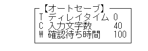

# 第３章 ファイルの操作

## ３.１ ファイル名の書式

&emsp;コマンドラインや『入力ファイル』ウィンドウで編集ファイル名を直接入力する時は、ディレクトリ名や拡張子を省略できます。また、複数のファイル名をスペースで区切って記述することもできます。 　
### ■ ディレクトリの省略

&emsp;MS-DOSには、コマンド検索パスを設定する「PATH」コマンドがありますが、VZも同じような機能をもっています。環境変数「VZPATH」に、文書ファイルを格納するディレクトリを「スペース」で区切って指定しておきます。これで、ディレクトリを省略したとき、指定したパスで順番にファイルを探してくれます。

［例］

	set vzpath=c:¥vz c:¥txt c:¥doc d:¥nif d:¥mix

- ディレクトリの終わりの「¥」は付けても付けなくても構いません。
- 余り沢山のディレクトリを設定すると、間違えてファイル名を入力した時に捜すのに時間がかかってしまいます。
- 環境変数「VZPATH」は、ファイルオープン時に参照しますから、VZ常駐時にコマンドラインで「VZPATH」を変更しすることもできます。
- ファイラーのPathメニューで⏎を空打ちするか、[**@**]キーを打つと、設定されている「VZPATH」のメニューが表示されます。

### ■ 拡張子の省略

&emsp;拡張子をピリオドごと省略した場合は、次の順番でファイルを探します。 　
1. 拡張子がないファイル
2. 「テキストファイル拡張子」をもつファイル
3. 「バイナリファイル拡張子」以外の拡張子をもつファイル

&emsp;テキスト／バイナリファイル拡張子は、それぞれDEFファイルに設定してあります。初期設定は次のとおりです。

	* E その他
	3	.doc .txt .bat .def .H .C .inc .asm .nif .mix
	9	.com .exe .dic .obj .lib .lzh

3番がテキスト、9番がバイナリファイル拡張子です。9番の行頭にセミコロン「;」をつけてその行をコメントとすると、テキストファイル拡張子をもつファイルのみ探します。拡張子がないファイルを開きたい場合は、「MAKEFILE.」のようにピリオドをつけてください。

●**9番のバイナリファイル拡張子の指定は、ファイラーのバイナリファイルの色分けにも使います。** 

### ■ 複数ファイルの指定

&emsp;複数のファイルを一度に読み込みたい場合は、ファイル名をスペースで区切って指定してください。ディレクトリや拡張子の省略もできます。

［例］

	¥config ¥autoexec⏎

### ■ ワイルドカード

&emsp;ドライブ名やディレクトリ名のみ、またはファイル名に「* ?」のワイルドカードを指定すると、ファイラーが起動し、指定したディレクトリの内容を表示します。

［例］

	c:¥doc⏎
	a:¥⏎
	.def .doc⏎

### ■ オプション指定

&emsp;ファイル名の後ろに、「-」に続けて次のようなオプションを記述できます。

	vz.def -1000		オープン後1000行目にジャンプ
	manual -we40		画面の横幅を40文字に設定

●**この他のオプションについては「3.5プロファイル機能」で説明します。** 

## ３.２ マルチファイル

&emsp;VZは、標準設定で最大10個のファイルをオープンすることができます。このうちの1つまたは2つのファイルを画面に表示して編集を行ないます。この節では、複数ファイルのオープン時の制限事項、および巨大ファイルを扱う際の「テンポラリファイル」について説明します。

### ■ 同時にオープン可能なファイル

&emsp;同時にオープン可能なファイルの最大数は、VZDEFのオプション***TC***で設定します。

	TC10		オープン可能なファイル数

&emsp;標準設定は最大10個です。これを100個程度まで増やすこともできなくはありませんが、1つにつき約220バイトのワークエリアを消費します。 　また、***TC***で設定した数だけ必ずオープンできるわけではありません。 　読み込んだファイルが大きい場合は、オプション***Bt***で設定したテキストバッファのサイズ分だけのメモリを占めます。

	Bt64		テキストバッファのサイズ (16..64KB)

&emsp;従って、64KB以上のファイルを5つも開けば、メインメモリは一杯になってしまいます。『モードメニュー』でステータス・ラインをシステム情報表示に切り替えて、メモリの残量を確認してみてください。小さなファイルは、ファイルのサイズ分のメモリしか消費しませんので、とくに気にする必要はありません。また、EMSメモリを使用できる場合は、テキストバッファをEMS上に開けますので、この制限はありません。XMS上には開けませんので注意してください。

&emsp;結論として、EMSが使えない環境で大きなファイルを5つ以上オープンしたい場合は、オプション***Bt***を16に減らしてください。ただしこうすると、テンポラリファイルをアクセスする頻度が増えますので、ジャンプ等の速度は低下します。

### ■ テンポラリ・ファイル

&emsp;64KBを越える大きなファイルを編集する場合は、メモリには64KB分しか読み込まず、その前後を「テンポラリ・ファイル」に出力します。

&emsp;Ver1.6では、EMS、XMS、TMPを、一元的に合計16MBまで管理できます。従来、EMSは2MBまでしか確保できませんでしたから、より大きなファイルを高速に編集できます。ただし、従来はテンポラリファイルのサイズに制限はありませんでしたが、Ver1.6では合計16MBまでということになります。

&emsp;編集テキストのテンポラリファイルは、

	XMS→EMS→TMP

の順番で使用します。TMPディレクトリに作成されるファイルは「VZTEMP.$$$」というただ1つのファイルです。

&emsp;テンポラリ・ファイルのディスクがいっぱいになったり、「VZTEMP.$$$」ファイルが、何等かの事情でアクセスできなると、

	テンポラリファイルエラー

というエラーが表示されます。このメッセージが出たら、即座に編集中のテキストを破棄してください。ファイルが壊れている可能性がありますので、セーブはしないでください。TMPディレクトリの空き容量に不安がある場合は、ファイルを読み込んだ後、まず[**Ctrl**]+[**Q**][**C**]でテキストを最後まで読み込み、再び[**Ctrl**]+[**Q**][**R**]で先頭に戻って上記エラーが表示されないことを確認してから、編集作業に入るとよいでしょう。

&emsp;また、次節で説明するビューモードを使えば、テンポラリファイルを使わずにファイルを読む事ができます。

## ３.３ リードオンリとビューモード

&emsp;ファイルを読みたいだけで、編集するつもりはない場合がよくあります。これをサポートするのが、「リードオンリモード」と「ビューモード」です。
### ■ リードオンリとビューモード
|キー|機能|
|---|---|
|[**Ctrl**]+[**K**][**R**] |リードオンリモード|
|[**Ctrl**]+[**Q**][**V**] |ビューモード|

&emsp;この2つのコマンドは似ていますが、動作が違います。まずリードオンリモードについて説明します。
### ■ リードオンリモード

&emsp;適当なファイルを開いて、[**Ctrl**]+[**K**][**R**]を打ってください。[**ESC**][**R**]でファイルをオープンしても結構です。ステータス・ラインの色が水色に変わりましたね。さらに、ファイル名の前に「R］の文字が付きました。これが、編集テキストがリードオンリモードに変わった事を表します。

&emsp;リードオンリモードのテキストは、通常のテキストと同様に編集できます。しかし、セーブできません。この点だけが違います。たとえば、古いファイルを参照しつつ、新しいファイルを編集する場合、両方を繁雑に切り替えるために、いつの間にか誤って古いファイルを編集してしまっている事があります。この時、古いファイルをリードオンリモードにしておけば、ステータス・ラインの色が変わるために、一目瞭然です。

&emsp;リードオンリモードは、もう一度[**Ctrl**]+[**K**][**R**]を打てば、編集モードに戻ります。

### ■ ビューモード

&emsp;ビューモードは、リードオンリモードをもっと厳しくしたモードです。まず[**Ctrl**]+[**Q**][**V**]を打ってください。画面の下に

	View mode

と表示されましたね。しかし、ステータスラインは変わりません。このコマンドは、編集中のテキストのモードを切り替えるのではなく、これからオープンするファイルを、ビューモードで開くのです。もう一度[**Ctrl**]+[**Q**][**V**]を押すと

	Edit mode

と表示し、編集モードに戻ります。では、ビューモードに切り替えて、適当なファイルを開いてみましょう。ステータス・ラインの色は、リードオンリモードと同じ水色ですね。ただし、ファイル名の前の文字は「V」です。

&emsp;ビューモードのテキストは、編集できません。文字キーを入力したり、編集コマンドを入力すると、画面の最下行に

	変更できません

と表示されます。ただし、次のキーは、別の機能を持ちます。
### ■ ビューモードの専用コマンド（Ver1.6）
|キー|機能|
|---|---|
|⏎|ファイルのクローズ|
|[**Shift**]+⏎|編集モードへ切り替える|
|[**Space**]|次画面へページング|

※**この機能はマクロで記述されており、自由に変更できます。** 

&emsp;ビューモードで開いたファイルは、[**Shift**]+⏎または[**Ctrl**]+[**K**][**R**]を押すと、編集モードに切り替わります。いったん編集モードにすると、ビューモードへ戻すことはできません。

- ディスク上のリードオンリ属性ファイルをオープンすると、自動的にビューモードになります。
- Ver1.5では、ファイルの先頭を表示していないと、ビューモードから編集モードへ切り替えられませんでした。Ver1.6ではいつでも即座に切り替えられます。

### ■ ビューモードの特長

1. テンポラリファイルを作らない
&emsp;ビューモードで開いたファイルは、編集されないために、大きなファイルでもテンポラリファイルを作成しません。このため、EMS／XMSメモリや、テンポラリディスクを消費せずに、巨大なファイルを表示できます。

2. 先頭／最後ジャンプが高速
&emsp;たとえEMS／XMSメモリを使用しても、数MBのファイルの先頭／最後ジャンプには時間がかかります。ビューモードで開けば、先頭へのジャンプ、2回目からの最後へのジャンプは、直接その箇所のみをディスクからロードするため、非常に高速です。

3. 大きなファイルの終端の変更
&emsp;大きなファイルの終端を少しだけ変更してセーブしたい場合は、よくあります。ビューモードで開いて最後にジャンプし、[**Shift**]+⏎で編集モードに変更してから修正すれば、セーブ時には、修正したファイルの終端部分のみを、上書きします。

- このとき、何等かの事情でファイルが入れ代わっている場合に備えて、上書きする位置からメモリとファイルの256バイトのデータを比較します。
- バックアップモードをオンにしている場合は、この機能は働きません。

&emsp;Ver1.6ではこれらの特長を生かして、巨大な通信のログファイルの高速アクセスを可能にしました。これについて次節で説明します。

## ３.４ ログファイルの管理

&emsp;パソコン通信でダウンロードしたログファイルは、とても大きなファイルになります。ほうっておけば、すぐに数MBに達してしまうでしょう。Ver1.6では、前節のビューモードの強化と、ログファイルの履歴保存機能により、日々膨れ上がるログファイルを、軽快にアクセスできます。

&emsp;では、ログファイルとはどんなファイルでしょうか。

1. サイズが巨大
2. 追加されるだけで、修正することはめったにない
3. 常にファイルの最後尾を開きたい

&emsp;Ver1.6では、ログファイルをオープンすると、自動的にビューモードとなり、最後に追加された位置へ即座にジャンプします。ファイルの先頭部分は読み込みません。このため、ファイルが数MBになろうとも、開く速度は全く変わりません。これが最大の特長です。

&emsp;ログファイルにダウンロードした日付をつけて、そのまま保存しておく人もいます。このような場合には、Ver1.6の機能はほとんど役にたちません。ログカッタ等でホスト、会議ごとのファイルにアペンドしている人のための機能と言えます。

&emsp;それでは、ログファイルの管理機能を使うための準備から説明しましょう。

### ■ 環境変数「VZLOG」

&emsp;ログファイルを格納しているパスを、環境変数「VZLOG」で設定する必要があります。「VZPATH」と同様に、複数のパスはスペースで区切ります。

［例］

	set vzlog=c:¥net¥log d:¥

ログファイルかどうかの判定は、オープンしたファイルのフルパス名の先頭部分と、「VZLOG」に設定されているパス名とを比較して行ないます。すなわち、この例では以下のファイルがログファイルと判定されます。

	c:¥net¥log
	c:¥net¥logname.mix
	d:¥nif¥fvc.nif
	d:¥mix¥vc.mix
	d:¥log1

● **「VZLOG」も「VZPATH」と同様に、ファイルのオープン時に参照します。** 

### ■ 履歴バッファ

&emsp;準備はこれだけです。では、ファイラーを使って「VZLOG」のファイルを何か開いてみましょう。自動的にビューモードになりましたね。ただし、ファイルの先頭を表示しています。ファイルの最後を開くようにするには、一度[**Ctrl**]+[**Q**][**C**]で最後へジャンプさせる必要があります。その後でファイルをクローズして、再び同じファイルを開いてください。今度は自動的に最後が開いたはずです。

&emsp;ログファイルにて[**Ctrl**]+[**Q**][**C**]を実行し、ファイルの最後にジャンプすると、最後の行番号とファイルサイズを、「履歴バッファ」と呼ばれるVZ内のワークへ保存します。ログファイルをオープンする時は「履歴バッファ」をチェックし、すでに開いたことのあるファイルであれば、自動的に最後へジャンプするわけです。

&emsp;履歴バッファのサイズは、オプション***Bv***で指定します。

	Bv1024		ログファイル履歴バッファサイズ

&emsp;***Bv0***とすると、ログファイルの履歴保存機能は効かなくなります。

履歴バッファがあふれた場合は、最初に記録された情報から捨てられていきます。履歴バッファへは、フルパス名で記録されますので、ログファイルのパス名はなるべく短くしておく方が、バッファを有効に利用できます。

### ■ 履歴ファイルVZ.ENV

&emsp;履歴バッファの内容は、全てのファイルをクローズし、編集を終了する時に、VZDEFディレクトリの「VZ.ENV」というファイルに自動的に保存されます。次節で述べる「プロファイル機能」とは異なり、CloseやeXitコマンドでファイルをクローズした時も保存されます。また、「VZ.ENV」ファイルが存在しない場合は、自動的に作成されます。

&emsp;「VZ.ENV」はバイナリファイルですが、各ファイルの情報はLFコード（0Ah）で区切られていますので、VZで編集し、不要なファイル名を削除することもできます。履歴情報のフォーマットは、次のとおりです。

	str 	ファイル名
	word	行番号
	long	カーソル位置のファイルポインタ
	long	ファイルサイズ
	byte	0Ah

&emsp;「VZ.ENV」は、VZ起動時にしか読み込みませんので、「VZ.ENV」を編集しても、すぐにその結果は反映されません。VZを終了するか、常駐時はいったん常駐を解除して再起動してください。

### ■ ログファイルの更新

&emsp;ログが追加されてサイズが増加したログファイルを開くと、今度はファイルの最後ではなく、追加された先頭位置へカーソルがジャンプします。会議のログファイルの未読部分の先頭を自動的に開いてくれる訳です。未読を読んでファイルをクローズし、再び同じファイルを開いても、やはり同じ位置へカーソルがジャンプします。次回ネットにアクセスしてログのサイズが増加するまでは、前回の未読部分の先頭を開くわけです。

&emsp;ログファイルはビューモードでオープンされますが、[**Shift**]+⏎で編集モードに切り替え、編集することもできます。このようにしてファイルの末尾を編集し、セーブすると、末尾のみを高速にセーブすることは、前節の「ビューモードの特長」で説明しました。 　編集して、ファイルのサイズが小さくなると、前回追加された位置はわからなくなるため、無条件にファイルの最後にジャンプします。

## ３.５ プロファイル機能

&emsp;「プロファイル機能」とは、編集時の状態をセーブし、起動時に再現する機能です。Ver1.5の基本機能では、編集ファイル名とカーソル位置の行番号しかセーブできませんでしたが、Ver1.6では次のように強化しました。

### ■ プロファイル機能の強化内容

#### 1. editfile に出力する内容を追加

&emsp;editfile には、次の3つのデータが出力されます。

- 文字列、ファイル名［、DOSコマンド］ヒトリーバッファ
- 起動時から変更されたオプション
- 編集ファイル名リスト

［例］

	:Sプロファイル^@初期化^@Sr^@^@		（^@はヌルコード）
	:Fvz16.doc^@vz^@vz.env^@editfile^@^@
	 -MP1 -QT5
	vzci.txt
	vzc3.txt ->39FF -+0 -KY10
	editfile ->1B -- -KY0
	¥vz¥16¥vz.def ->2FE7

#### 2. ファイル名に続くオプション指定を拡張

	->xxxxx		カーソル位置のポインタ（x:16進数）
	-+n		Activeテキスト（n:分割モード）
	--		Backテキスト
	-#n=xxxxx	マーク＃nのポインタ
	-opt		編集テキストオプション（-MR -WEn -KYn等）

#### 3. プロファイルオプション***Sr***を拡張

	Sr5	プロファイルモード
	  +1	プロファイル情報のセーブ
	  +2	editfile が存在しない場合に、自動作成
	  +4	ファイルクローズ時に、ヒストリーに情報を格納
	  +8	「vz⏎」で「vz @」の動作
	  +16	ログファイルの情報も、ヒストリーに格納
	  +32	DOSコマンドのヒストリーも出力する
	  +64	ヒストリーを出力しない

#### 4. 「@」指定時の editfile のサーチ方法を変更

	@		カレント→VZDEFディレクトリの順にeditfileをサーチ
	@@		VZDEFディレクトリでeditfileをサーチ
	@profile	カレント→VZDEFディレクトリの順にprofileをサーチ
	@@profile	VZDEFディレクトリでprofileをサーチ
	@¥doc¥		¥doc¥にchdir後、editfileをサーチ
	@¥doc¥profile	¥doc¥にchdir後、profileをサーチ

●「**@**」**と**「**@@**」**の意味がVer1.5と逆転しています。** 
●**常駐する際に「vz -z @@」でヒストリーとオプション設定のみロードできます。** 

#### 5. ファイルクローズ時のファイル情報のセーブ

&emsp;通常のプロファイル機能では、編集ファイルの情報は、編集終了時に開いていたものしか出力されません。このため、簡易履歴機能として、カーソル位置、マーク情報等を、ファイルクローズ時にファイル名ヒストリーバッファに格納する機能をつけました。

●**カーソル位置がファイル先頭にある場合には、機能しません。** 
●**Loadコマンドでクローズ・オープンする場合は、機能しません。** 
●**同一ファイルの情報は、ヒストリーバッファ内で1つしか保存されません。** 

#### 6. 起動時オプションの保存

&emsp;起動時（DEFファイルのインクルード後）の特定のオプション設定を記憶し、起動後に変更されたものを、editfile に出力します。

### ■ プロファイル情報の保存

&emsp;プロファイル情報は、Quitコマンドでエディタを終了する際に保存されます。Closeで全ファイルをクローズした時は保存されません。

■ プロファイル機能 
|キー|機能|
|---|---|
|[**ESC**][**Q**]|エディタを終了|
|[**ESC**][**W**]|プロファイル情報のセーブ|
|[**Ctrl**]+[**K**][**O**]|オプションの初期化|

&emsp;プロファイル機能を使いたくない場合は、オプション***Sr***を「***0***」にしてください。ただし、その場合でも、[**ESC**][**W**]でセーブすることはできます。

&emsp;プロファイル情報は、カレントディレクトリ、およびVZDEFディレクトリの「editfile」というファイルへ保存されます。通常は、editfileは自動作成されません。これは、カレントディレクトリに勝手に editfile を作ってしまわないためです。ファイラーのNew Fileコマンドを使えば、簡単に空の「editfile」を作ることができます。これが面倒な場合は、オプション***Sr***に「***+2***」を指定してください。

	Sr5+2		editfile が存在しない場合に自動作成

&emsp;「editfile」というファイル名を他のもの、例えば「profile」に変更したい場合は、DEFファイルの次の箇所を変更してください。

	* E その他

	2	profile

## ３.６ バックアップとオートセーブ

&emsp;大切な文書ファイルを、ちょっとしたミスで消してしまっては大変です。何時間もかけて書いた文書が、突然のハングアップで消えてしまったら悲劇です。バックアップとオートセーブは、このようなトラブルを防ぐための安全策のひとつです。

&emsp;しかし、本当に大切な文書ファイルは、異なるメディアに複数コピーのバックアップをとっておくべきです。これは、本ソフトに付属する「ZCOPY」を使えば、高速に行なえます。

### ■ .BAK

&emsp;バックアップで一番昔から使われている方法が、セーブ前のファイルの拡張子を「.BAK」に変更して保存する機能です。しかしこの方法にはいくつかの問題点があります。

1. **ファイル名が同じで拡張子だけが異なるファイルは、同一のバックアップファイルになってしまう。**

2. **文書ファイルと同じディレクトリにバックアップファイルを作成するため、誤ってディレクトリのファイルを全て消してしまった場合は、いっしょに消えてしまう。**

3. **文書ファイルと同じ数の.BAKファイルが作られて、目障り。**

&emsp;このため、次の方法をお薦めします。

### ■ 環境変数「VZBAK」

&emsp;環境変数「VZBAK」にバックアップ用のディレクトリを設定します。

&emsp;［例］

	set vzbak=¥trash	★　ドライブ名を付けてはいけません！

こうしておくと、ファイルセーブ時に、古いファイルを、同じドライブの「¥trash」というディレクトリへ移動します。MS-DOSは、同一ドライブ内のディレクトリならば、瞬時にファイルを移動させる機能をもっています。これを利用しているわけです。

&emsp;従って、異なるドライブへファイルを保存することはできません。複数のドライブの文書ファイルを編集しセーブすると、それぞれのドライブに「¥trash」ディレクトリが作成されます。

- 環境変数「VZBAK」は、起動時ではなく、ファイルセーブ時に参照します。
- ログファイルに限っては、バックアップモードがオンになっていても、バックアップはしません。
- ファイルのバックアップは、初期設定ではOFFになっています。モードメニューの『B バックアップ』をONにするか、オプション***Eb***を「***+***」に設定してください。

 		Eb-		バックアップファイルの作成

### ■ オートセーブ

&emsp;Ver1.6では、キーボードから一定の文字数を入力後、一定時間キー入力がない場合に、オートセーブを起動することができます。

&emsp;オートセーブの設定は、サブメニュー『S オートセーブの設定』で行ないます。

ディレイタイムを0以外の値にセットすると、オートセーブが有効になります。

各メニューの初期値は、オプション***Qc***、***Qt***、***Qw***で設定できます。

	Qt0		キー入力のない時間の設定（0<=Qt<3600[秒], 0=無効）
	Qc40		オートセーブを起動するまでの入力文字数
	Qw100		確認待ち時間（単位:約1/50秒、0=ただちにオートセーブ）

&emsp;オートセーブが起動すると、まず

	オートセーブしますか？

と表示し、約1秒間待ちます。この間にキー入力があれば、

	キャンセルしました

と表示され、オートセーブはキャンセルします。再び***Qc***の文字数入力しないと、オートセーブは起動しません。 　***Qw0***とすれば、このキャンセル確認待ちメッセージは表示せず、ただちにセーブを行ないます。

